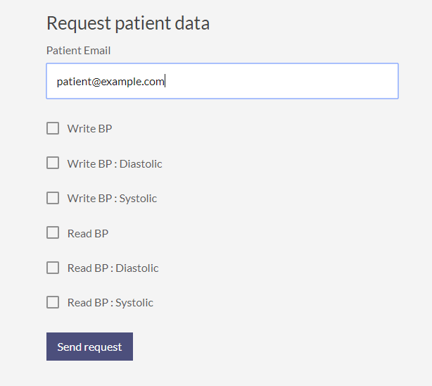
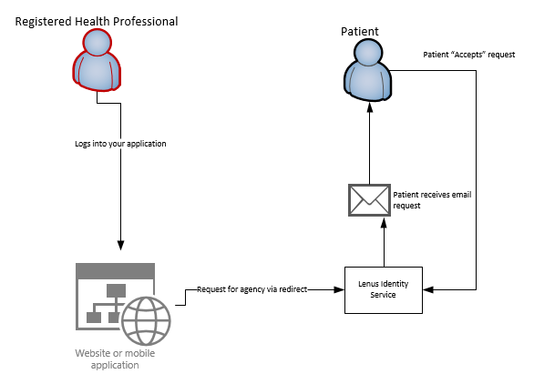

# Requesting Agency for an individual

*This feature is only available to Lenus accounts verified as heatlh professionals*

## Overview

In order for a health professional to access and review the health data of a patient they must request "agency" for the patient.  This requires that the patient is sent an agency request email from the Lenus platform.  This email is initiated by the health professional completing a form:

The Health professional enters the email address of a patient, then selects the health data they wish to see.  Upon sending the request an email is sent to the patient (if they exist).  When the patient receives the email it will contain information that allows them to determine whether to accept the request or not.  When accepting via the email the patient will be asked to login to their Lenus account, after which a consent screen will be presented.  The patient completes the consent process, after which the health professional will be able to query only the specifically consented data of the patient.

